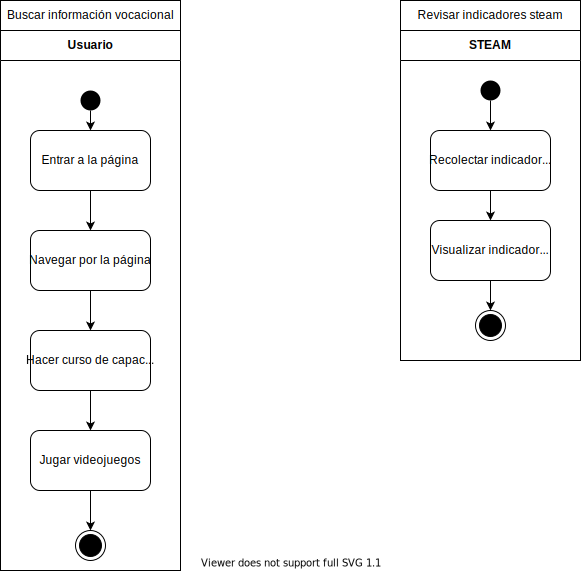

# UML Modeling

## Table of content

- [Business diagrama de caso de uso](#Business-diagrama-de-caso-de-uso)
- [Business diagrama de actividades](#Business-diagrama-de-actividades)
- [Página web diagrama caso de uso](#Página-web-diagrama-caso-de-uso)
- [Página web diagrama de actividades](#Página-web-diagrama-de-actividades)
- [VideoJuego diagrama de caso de uso](#VideoJuego-diagrama-de-caso-de-uso)
- [VideoJuego diagrama de actividades](#VideoJuego-diagrama-de-actividades)

## Business diagrama de caso de uso

## Business diagrama de actividades

## Página web diagrama caso de uso

## Página web diagrama de actividades

## VideoJuego diagrama de caso de uso

## VideoJuego diagrama de actividades

